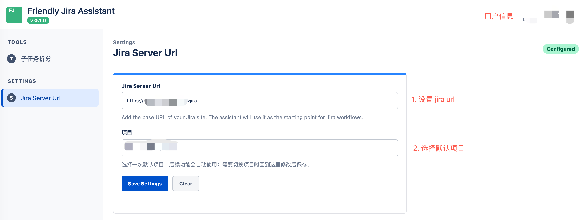
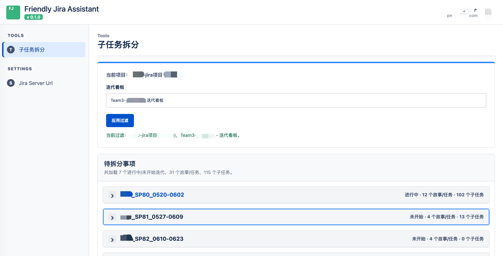
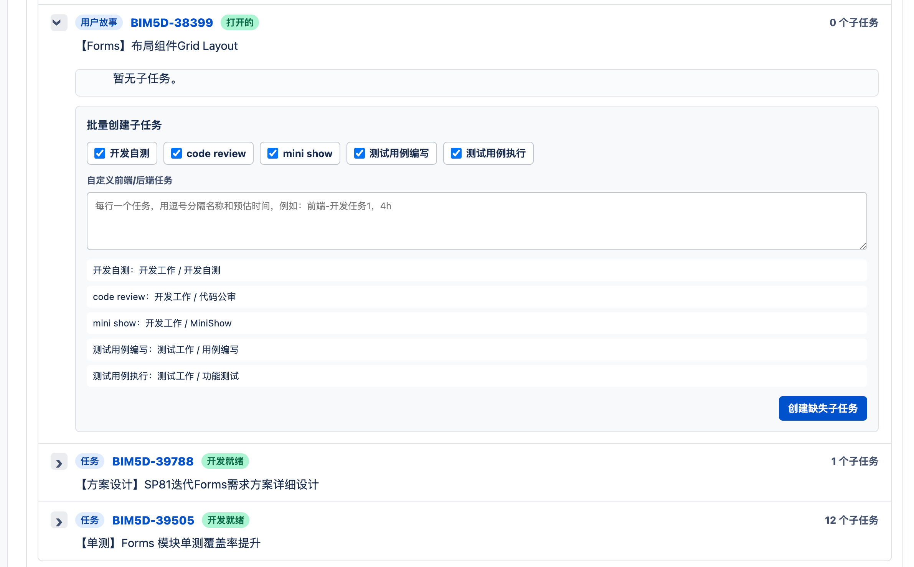

# Friendly Jira Assistant

* Friendly Jira Assistant is a chrome extension for Jira pages.
* Help us create subtasks faster and more efficiently.

## 要解决的问题：
jira中 每个子任务得一个个创建，选工作类型标签，选所在小组，没次都填很繁琐
而且每个用户故事都有重复的 开发自测，功能测试，代码评审等 重复性任务，这个也得每次手动创建很繁琐

现在可以这样：
* 固定的任务可以自动创建
* 前端- 开头的子任务会自动标记任务分类为：前端开发，后端-开头的子任务会被标记为任务分类为：后端开发
* 可以批量创建子任务：
  前端-开发任务1，4h
  前端-开发任务2，5h
  后端-开发任务3，6h
  

## Screenshots
### jira server setting:


### sprint info:


### subtask breakdown:



## Project Structure

```text
.
├── manifest.config.ts       # Extension manifest generated by CRXJS
├── vite.config.ts           # Vite build config
├── src/
│   ├── background/          # Service worker entry
│   ├── content/             # Jira page content script
│   ├── options/             # Extension options page
│   ├── popup/               # Browser toolbar popup
│   ├── shared/              # Shared constants and messaging types
│   └── types/               # Local type declarations
└── spec/                    # Product notes and UI references
```

## Commands

```bash
npm install
npm run dev
npm run build
```

After building, load the `dist` directory as an unpacked extension in Chrome or Edge.
